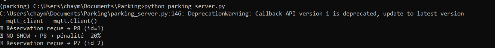
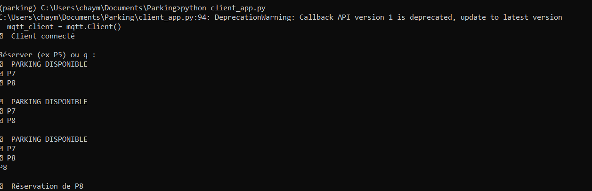

# Edge-Intelligent Smart Parking with Quantized Vision and IOTA-Based On-Chain Enforcement

---

## Overview

This repository presents an end-to-end cyber–physical smart parking framework that integrates edge-based computer vision with blockchain-enabled reservation enforcement.

The system combines:

- YOLOv12-based vehicle detection
- Post-training quantization (FP16 / INT8)
- MQTT-based communication layer
- IOTA EVM smart contract enforcement

The proposed architecture establishes a direct connection between real-world perception events and deterministic on-chain reservation logic.

---

## Architecture

The framework is structured into three main layers:

1. **Perception Layer** – YOLO-based vehicle detection with ROI-based parking occupancy analysis  
2. **Communication Layer** – MQTT publish/subscribe messaging infrastructure  
3. **Blockchain Layer** – IOTA EVM smart contracts for reservation and enforcement  

---

## Perception Module

### Training Configuration
- Dataset: UA-DETRAC  
- Single-class vehicle detection (vehicle occupancy focus)  
- Frame sampling stride = 5  

### Model Export Pipeline
PyTorch → ONNX → TensorRT (FP16 / INT8)

### Quantization Modes
- FP16 (reduced precision inference)
- INT8 Dynamic quantization
- INT8 Static quantization (1000 calibration samples)

---

## IOTA Module

### Smart Contract Features
- NFT-based reservation mechanism
- Escrow-based payment logic
- Arrival confirmation verification
- Automated no-show enforcement
- Dynamic trust score updates

### Deployment Network
IOTA EVM Testnet

---

## Edge Deployment

### Hardware Platform
Jetson Orin Nano Super Developer Kit

### Measured Performance
- 51 FPS (FP16 inference)
- ~20 ms average latency
- 66% model size reduction (INT8)

---

## Reproducibility

This repository includes:

- Training scripts
- Quantization scripts
- Hardhat smart contract implementation
- MQTT bridge implementation
- Example ROI configuration files


## Getting Started

Follow the steps below to run the complete smart parking system.

---

### 1. Install Dependencies

Install all required Python libraries:

```bash
pip install -r requirements.txt
```

### 2. Deploy the Smart Contract (IOTA EVM)
Navigate to the IOTA directory and deploy the smart contract on the IOTA EVM testnet.
After deployment:
* Copy the deployed contract address
* Open config.py
* Paste the contract address into the corresponding configuration field

This step enables the backend server to interact with the blockchain.

### 3. Define Parking Regions (ROIs)
Before running the system, parking slot regions must be configured.
Execute:

``` bash
python BBox/Create_BBox.py
```
This script allows manual selection of parking areas and generates the ROI configuration file.

### 4. Start the Parking Server
Launch the backend server responsible for: Vehicle detection, Parking slot occupancy monitoring ,Blockchain event handling , Real-time visualization

Run:

```bash
python parking_server.py
```


The server will display parking occupancy status visually.

### 5. Launch the Client Application
To simulate a user interface for drivers:
```bash
python client_app.py
```



The client application: Displays available parking spaces in real time, Allows reservation submission, Interacts with the deployed smart contract
